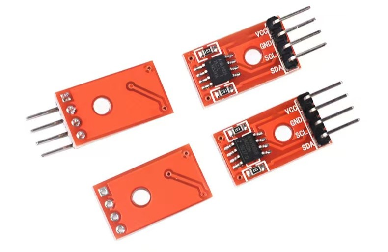
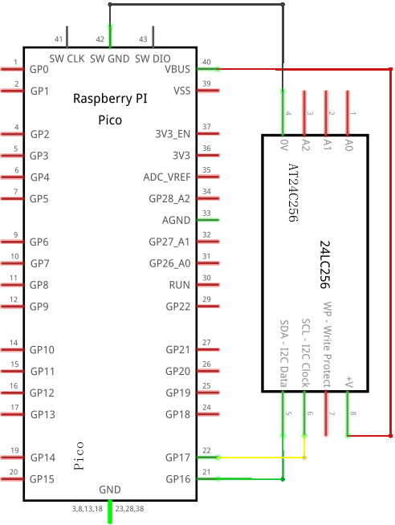
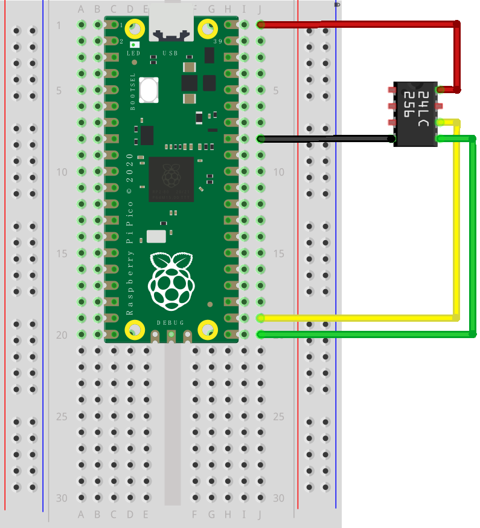

# AT24C256

## 一、接线

| AT24C256 Pin | 说明            | Pico Pin |
| ------------ | --------------- | -------- |
| VCC          | 电源 +5.0V 直流 | VBUS     |
| GND          | 电源地          | GND      |
| SDA          | 串行数据线      | GP16     |
| SCL          | 串行时钟线      | GP17     |

## 二、示意图

### 实物图




### 原理图



### 面包板



## 三、示例程序

> 实现的这个 at24c256 驱动，速度有点慢！但是，不用考虑分页问题！指定从第几个字节开始，就可以写入数据了！

> at24c256_demo.py

```python
from machine import Pin, I2C
from at24c256 import AT24C256


i2c = I2C(0, freq=10000, sda=Pin(16), scl=Pin(17))
it = AT24C256(i2c)

it.write(0, 'hello')  # 从第0个字节位置开始写，写入5个字节的 hello
data = it.read(0, 5)  # 从第0个字节位置开始读，读取5个字节
print('data:', data)
```

## 四、使用手册

