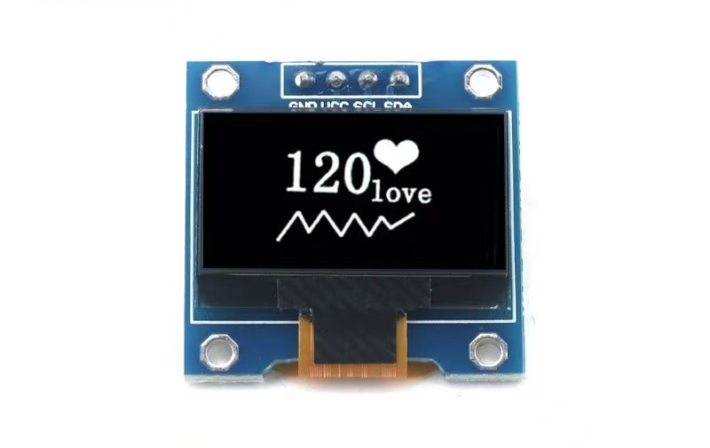
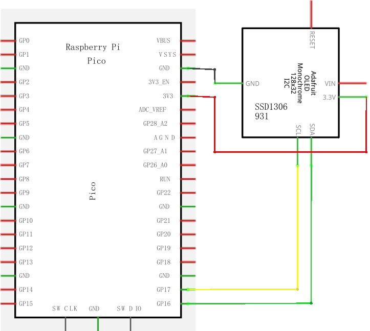
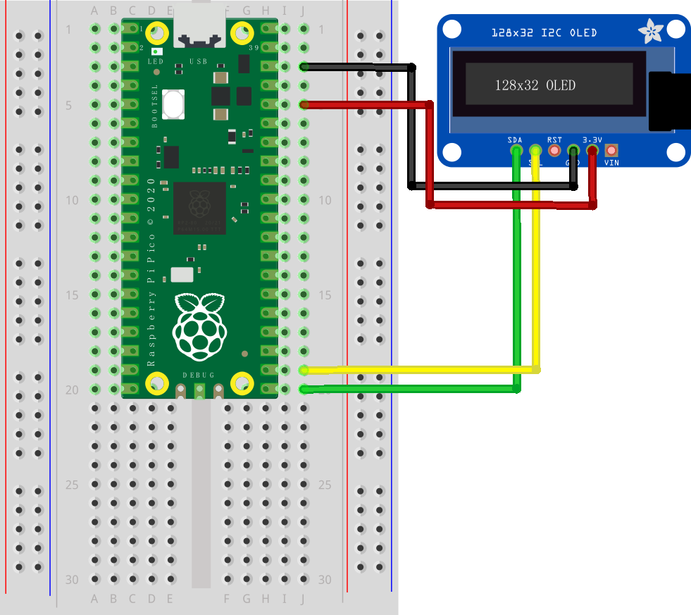

# SSD1306

> 宽×高：128 × 64

## 一、接线

| AT24C256 Pin | 说明                        | Pico Pin |
| ------------ | --------------------------- | -------- |
| VCC          | 电源 +5.0V 直流（3.3V也行） | VBUS     |
| GND          | 电源地                      | GND      |
| SDA          | 串行数据线                  | GP16     |
| SCL          | 串行时钟线                  | GP17     |

## 二、示意图

### 实物图




### 原理图



### 面包板



## 三、示例程序

> ssd1306_demo.py

```python
from machine import Pin, I2C
from ssd1306 import SSD1306_I2C


i2c = I2C(0, sda=Pin(16), scl=Pin(17), freq=100000, timeout=5000000)  # 频率和超时会有影响

led = SSD1306_I2C(128, 64, i2c)

led.text('hello', 5, 15)
led.show()
```

## 四、使用手册

