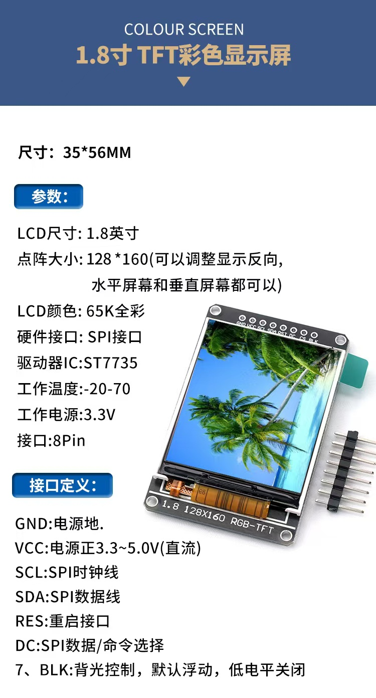
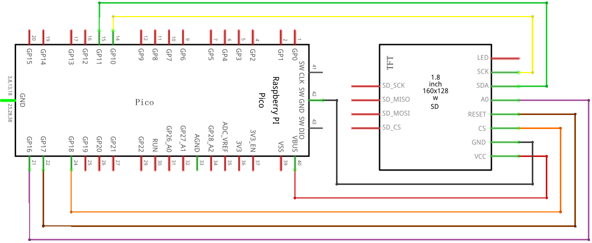
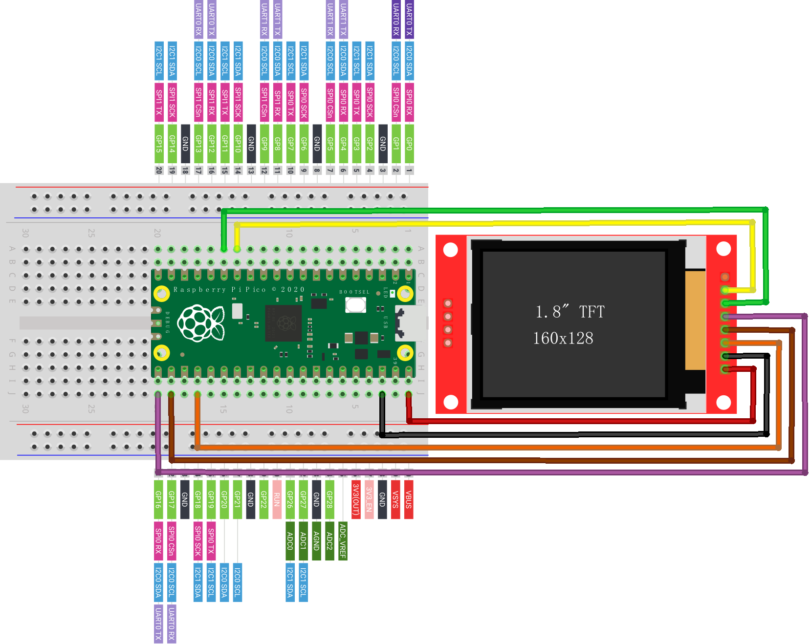

# ST7735(S)

## 一、接线

| ST7735 Pin | 可选 | 说明                           | Pico Pin |
| ---------- | ---- | ------------------------------ | -------- |
| GND        |      | 电源地                         | GND      |
| VCC        |      | 电源正3.3~5.0V直流             | VBUS     |
| SCL (SCK)  |      | SPI时钟线                      | GP10     |
| SDA (MOSI) |      | SPI数据线                      | GP11     |
| RST (RES)  |      | 重启接口                       | GP17     |
| DC (A0)    |      | SPI数据                        | GP16     |
| CS         |      | 片选，命令选择                 | GP18     |
| BLK        | 是   | 背光控制，默认浮动，低电平关闭 |          |
| 其他       | 是   | 其他 Pin                       |          |

## 二、示意图

### 实物图




### 原理图



### 面包板



## 三、示例程序

> st7735_demo.py

```python
from machine import SPI
from st7735 import TFT
from sysfont import sysfont


spi = SPI(1, baudrate=1000000, polarity=0, phase=0, bits=8, sck=10, mosi=11)
tft = TFT(spi, 16, 17, 18)

tft.initr()
tft.rgb(True)
tft.fill(TFT.BLACK)
tft.text((10, 10), "Hello World!", TFT.RED, sysfont, 1, nowrap=True)
```

## 四、使用手册

